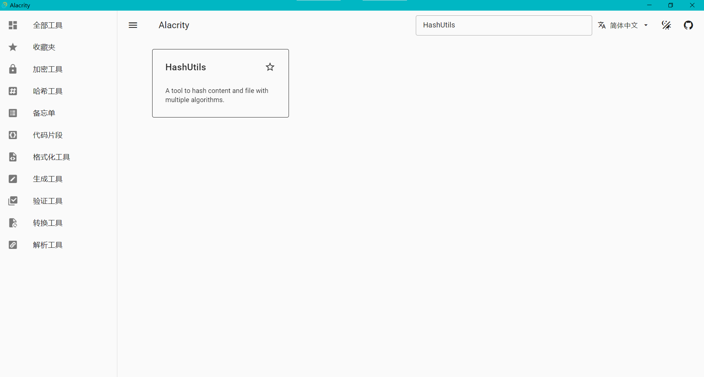

# Alacrity: 开发者工具箱

[English](./README_en.md) [中文](./README.md)

# 运行

```shell
git clone https://github.com/origin-coding/Alacrity.git
cd Alacrity

yarn install
npm run "tauri dev"
```

# 从源码构建

```shell
yarn install
npm run "tauri build"
```

# Alacrity功能详解


应用左侧的导航栏显示了Alacrity所有的应用类别，可以通过点击他们对应用进行筛选。

应用上方的导航栏列出了常用的工具，比如搜索插件、切换语言、主题等功能。

下方的应用主题部分则是插件的列表，可以通过点击卡片使用插件，也可以点击右上角的星号将插件添加到收藏夹中。

# 已有的插件

1. Base64：对图片和文本进行Base64加密/解密。
2. BaseConvert：数字进制转换，支持二进制、八进制、十进制和十六进制。
3. FloatConvert：支持IEEE 754标准浮点数转换为二进制和十六进制，也支持单精度/双精度浮点数转换。
4. HashUtils：支持常用的哈希算法对文本和文件进行哈希。
5. QRCode：常用二维码生成以及保存到图片。
6. RequestHeaders：查看HTTP响应头。
7. StatusCode：常用HTTP响应代码。
8. URLParse：解析URL，获取到URL的各个部分
9. UUID：随机生成UUID并对UUID进行验证。

# 开发计划

1. [ ] 多语言支持：翻译更多的插件。
2. [ ] 插件支持：预计在2024.03之前，开发20-30个插件。
